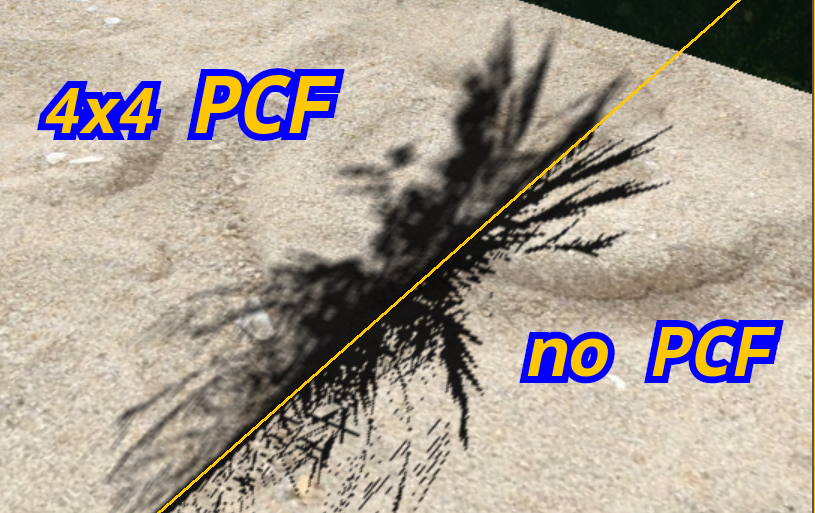

# Task 07 - Shadowmapping, Teil 2, Percentage Closer Filtering



Sie werden festgestellt haben, dass Sie, je nach Auflösung der Shadowmap
und Positionierung der Lichtkamera in ein Aliasingproblem bei der
Darstellung des Schattens im Randbereich laufen. Ausserdem
existiert in der realen Welt kein absolut harter Schatten. Beiden Problemen
lässt sich durch das sogenannte *Percentage Closer Filtering*, kurz: *PCF*,
entgegenwirken: Anstatt den Schattentest für jedes Fragment nur einmal
durchzuführen und damit über beleuchtet oder unbeleuchtet zu entscheiden,
tastet man eine **Umgebung** um das Fragment herum ab. Für jedes Fragment
innerhalb der Region wird der Schattentest durchgeführt und das Ergebnis
(1.0 = Beleuchtet, 0.0 = im Schatten) auf die anderen Schattentests
aufsummiert und der Durchschnitt gebildet. Das Ergebnis besagt "zu wie viel
Prozent sich das untersuchte Fragment im Schatten befindet."

Eine gute Erklärung finden Sie hier: https://developer.nvidia.com/gpugems/gpugems/part-ii-lighting-and-shadows/chapter-11-shadow-map-antialiasing

*Hinweis*: Der auf der Seite gezeigte Beispielcode ist kein GLSL!

## 7.0) Erweitern Sie Ihr Programm aus Task 06 um 4x4 PCF. 
Damit Sie den Schattentest innerhalb der `texture()`-GLSL-Funkion durchführen
können, müssen Sie Ihrer depth-map folgendes Attribut zuweisen:
```cpp
glTextureParameteri(depthTexture, GL_TEXTURE_COMPARE_MODE, GL_COMPARE_REF_TO_TEXTURE);
```
Ausserdem müssen Sie anstatt eines `sampler2D` einen `sampler2DShadow`
im Fragment-Shadercode für Ihre depthmap-Textur verwenden, damit Sie
einen `vec3` als Texturkoordinaten an `texture()` übergeben können.
Dokumentation dazu finden Sie hier: https://wikis.khronos.org/opengl/Sampler_(GLSL)

*Hinweis*: Vergessen Sie nicht, auch die z-Koordinate Ihrer in den
Normalized Device Space projezierten Position auf [0.0, 1.0] zu mappen.
Zur Erinnerung: Ist nichts anderes eingestellt, so befinden sich die
Koordinaten im NDC für x, y, z im Intervall [-1.0, 1.0].

## 7.1) GUI
Fügen Sie in der GUI eine Checkbox hinzu, mit der Sie PCF
an- bzw. ausschalten können.

## 7.2) Performance
Fügen Sie in ihr GUI-Fenster eine Textanzeige hinzu, die Ihnen
die Frametime und FPS darstellt. Dazu können Sie sich existierender
ImGui Funktionalitäṱ bedienen. Sie holen sich zunächst den
aktuellen IO-State Ihres ImGui Contexts:
```cpp
ImGuiIO& io = ImGui::GetIO();
```
Und fügen dann folgenden Code Ihrem existierenden ImGui UI code hinzu:
```cpp
ImGui::Begin("PCF controlls");
// Your existing GUI controlls, like PCF on/off etc...
ImGui::Text("Application average %.3f ms/frame (%.1f FPS)", 1000.0f / io.Framerate, io.Framerate);
ImGui::End();
```
Fügen Sie nun auch eine Checkbox hinzu, um VSync ein- bzw. auszuschalten.

Testen Sie nun folgendes Szenario bei ausgeschaltetem VSync:
Starten Sie Ihr Programm mit unterschiedlichen Shadowmap-Grössen
und schalten Sie PCF ein/aus und notieren Sie die FPS für:
- 1024x1024
- 2048x2048
- 4096x4096
- 8192x8192  
Shadowmap Texturgrössen.

*Hinweis*: Sie müssen die Texturemap-Texturgösse **nicht** über die GUI
ändern können. Es reicht, wenn Sie das Programm 4x mit neu Kompilieren.


## 7.3) Dokumentation
Beantworten Sie die folgenden Fragen:

- Macht es Sinn, Schatten vollständig in Schwarz zu rendern? Wenn ja, warum? Wenn nicht,
  warum nicht?
- Wie hat sich die Texturgrösse auf die Performance Ihres Programms ausgewirkt? Hat PCF
  die Performance erhöht oder erniedrigt? Wenn ja, um wie viel Prozent?
- PCF ermöglicht zwar einen weicheren Übergang am Rand des Schattens, lässt aber (mind.) eine physikalische
  Begebenheit ausser acht. Welche ist das?


